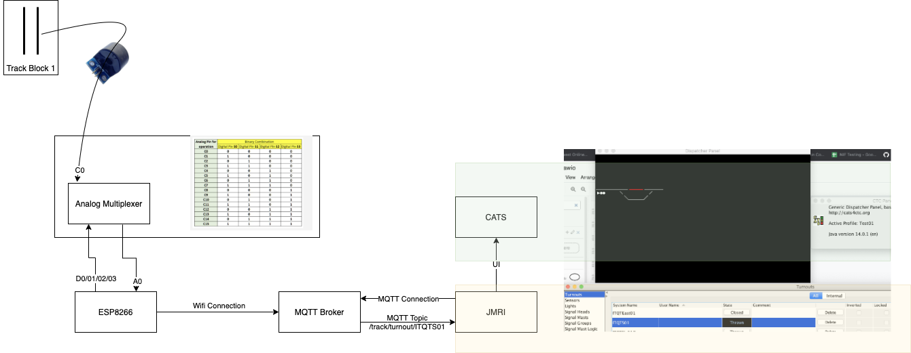

# block-detection-poc

## Introduction
This repo contains a couple of resources around a POC I did for block detection for DCC in a model railway. Its *quite* rough, but my plan is to expand it into a workable system for my railway.

It is cobbled together from a couple of different resources, however [this repo](https://github.com/rpsimonds/thenscaler) (and associated website) is primarily where I drew a lot of the inspiration from.

## Diagram

## Overview
- An ESP8266 is used to collect sensor data. Reason for using this board is primarily for the builtin wifi, and the small form factor. An Analog multiplexer will be used to expand the list of analog inputs from 1 to 16. The multiplexer channel is switched using 4 digital outputs.
- The inputs are sampled and for each input, occupancy is determined. Based on this, a message is sent via an MQTT Topic to a broker, which is connected to JMRI.
- Within JMRI, CATS is used for the signalling system. Currently CATS uses the JMRI turnout table for all of its devices, so the occupancy data is sent to a /trains/turnouts/*CATS-ID* topic.

## The POC
- Only collects data from the A0 sensor on the board
- The occupancy logic is fairly simplistic - it doesn't use the dynamic detection method that is used in the source repo. Since my block is only 30cm, I expect larger blocks will require the improved approach where an object stores per-sensor sensitvities described [here](https://github.com/rpsimonds/thenscaler/blob/Current-Sensing/CT_Sensor.ino).

## Components Used
- ESP8266 Board
- [Current Sensor](https://www.banggood.com/3Pcs-5A-Range-Single-phase-AC-Current-Transformer-Current-Sensor-Module-p-1261925.html?cur_warehouse=CN&rmmds=search)
- [Analog Multiplexer](https://solarduino.com/increase-analog-pins-for-nodemcu-using-16-channel-analog-multiplexer-module/)

## Useful Links
- [TheNScaler](http://thenscaler.com/) Blog that has a lot of useful info on block detection experiments using Arduino
- [CATS101](https://www.youtube.com/watch?v=H-P1guhnVpw&list=PLfmcarbF8DzEG9taeiSSWonbz3h6VQs3F) A YouTube Playlist that is a collection of clinics getting started with CATS and JMRI

I will update this repo as I start implementing it on the layout, so hopefully the code will get a bit better over time as I get to grips with Arduino Programming.
