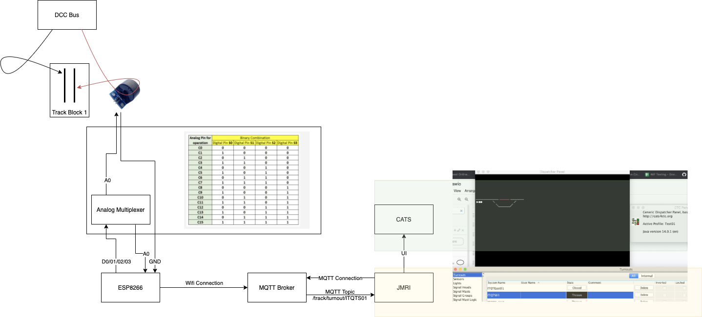

# block-detection-poc

## Introduction
This repo contains a couple of resources around a POC I did for block detection for DCC in a model railway. Its *quite* rough, but my plan is to expand it into a workable system for my railway.

It is cobbled together from a couple of different resources, however [this repo](https://github.com/rpsimonds/thenscaler) (and associated website) is primarily where I drew a lot of the inspiration from.

## Overall Diagram

